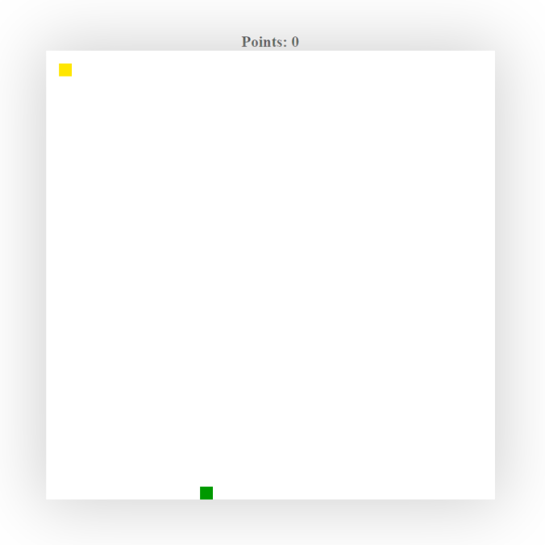

<h1 align="center">
PIXEL GAME
</h1>

This is a simple game developed while I was learning canvas, so I decided to create a simple game system and this was the result.

  

  

## Getting started

Access the website preview link by clicking __[here](https://execatsu.github.io/PixelGame/)__ or clone this repository and try to fax your own modifications!

> If the shortcut above doesn't work, go to this link: 
https://execatsu.github.io/PixelGame/

## License

This project is licensed under the MIT License - see the [LICENSE](https://opensource.org/licenses/MIT) page for details.